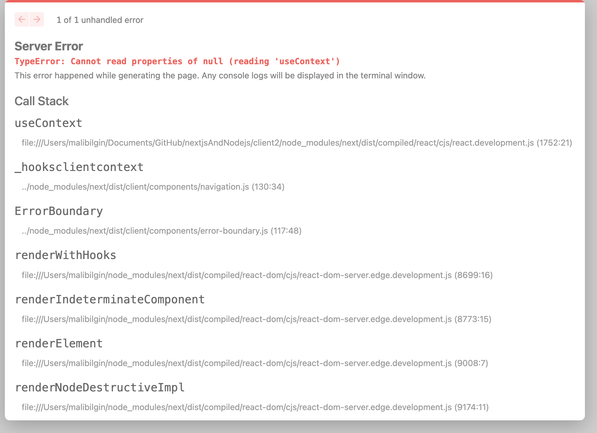

# nextjsAndNodejs
Test Nextjs and Nodejs together

NOT: server1.js == server2.js, server1.js not work but server2.js is work. just diffrent between, i add "dir: "./client2" on the server1.js

==I want to run the server1 file in its location. is there no way?==

server1.js:
`const app = next({ dev, dir: "./client2" });`
server2.js
`const app = next({ dev });`;

1- `git clone https://github.com/muhammedalibilgin/nextjsAndNodejs.git`
2- `cd nextjsAndNodejs`
3- `cd client2`
4- `npm i`
5- `node server2.js`

and get the [http://localhost:3000/](http://localhost:3000/) on the browser. its worked success. No problem.

but
6- `cd ..`
7- `npm i`
8- `node server1.js`

Here is error:

> I want to run the server1 file in its location. is there no way?

